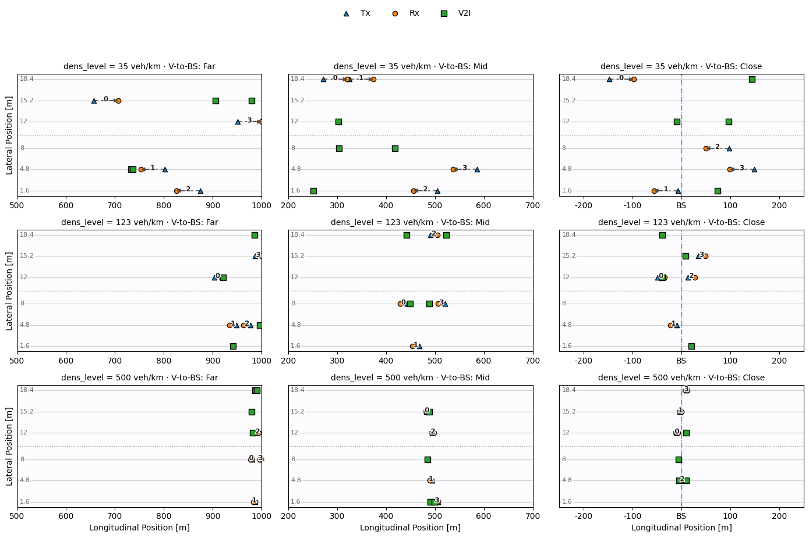

# V2X-MARL-Bench

A benchmarking framework for evaluating multi-agent reinforcement learning (MARL) algorithms in Cellular Vehicle-to-Everything (C-V2X) radio resource allocation. The framework models the problem as a set of interference games with increasing complexity, and provides standardized environments and evaluation protocols for fair and reproducible comparison.

Built with simplicity in mind — no heavy dependencies, no complex setup. If you have Python and PyTorch, you are ready to go.

---

## Table of Contents

- [Overview](#overview)
- [Installation](#installation)
- [Quick Start](#quick-start)
- [Repository Structure](#repository-structure)
- [Task Types](#task-types)
- [Algorithms](#algorithms)
- [Citation](#citation)
- [License](#license)

---

## Overview

C-V2X resource allocation requires vehicles to jointly select subchannels and transmission power levels to maximize network throughput while managing interference. V2X-MARL-Bench formulates this as a multi-agent interference game and benchmarks 8 MARL algorithms across 4 task types of increasing complexity and observability.


---

## Installation

**Requirements:** Python 3.10+

Clone the repository:
```bash
git clone https://github.com/Deepinlab2023/V2X-MARL-Bench.git
cd V2X-MARL-Bench
```

Install dependencies:
```bash
pip install -r requirements.txt
```

Dependencies (`requirements.txt`):
```
torch==2.6.0
numpy==2.2.2
pandas==2.2.3
matplotlib==3.10.0
scipy==1.15.1
scikit-learn==1.5.2
```

---

## Quick Start

Run an experiment using the following command pattern:
```bash
python main.py --env <ENV> --algo <ALGO> [options]
```

**Arguments:**

| Argument | Description |
|----------|-------------|
| `--env`  | Task type: `NFIG`, `SIG`, or `POSIG` |
| `--algo` | Algorithm: `idql`, `hys`, `vdn`, `qmix`, `ia2c`, `maa2c`, `ippo`, `mappo` |
| `--loc`  | Location index (NFIG and SIG SL only; omit for SIG ML and POSIG) |
| `--n_agent` | Number of agents: `4`, `8`, or `16` (default: `4`) |
| `--train_data` | Path to a custom training CSV (overrides default dataset) |
| `--test_data`  | Path to a custom evaluation CSV (overrides default dataset) |

**Examples:**
```bash
# NFIG, 4 agents
python main.py --env NFIG --loc 0.0 --algo idql

# SIG Multi-Location, 16 agents, reproducible
python main.py --env SIG --algo mappo --n_agent 16 --seed 42

# SIG Multi-Location, custom training and evaluation data
python main.py --env SIG --algo ippo --n_agent 16 \
    --train_data Environment/SUMOData/SIG_ML_k16.csv \
    --test_data  Environment/SUMOData/NFIG_k16.csv

# POSIG
python main.py --env POSIG --algo ippo --n_agent 16
```

For NFIG and SIG SL, `--loc` selects one of 9 predefined vehicle topologies that vary traffic density and relative distance to the base station (BS). BS distance reflects the longitudinal offset between the road segment occupied by vehicles and the BS, which depends on the number of agents and vehicle density. All 9 topologies are supported for 4, 8, and 16 agents. For SIG ML and POSIG, use `--n_agent` to select the agent count (default datasets are provided for all three settings). Algorithm hyperparameters and environment settings can be configured in the `Configuration/` directory.

| `--loc` | Density (veh/km) | BS Distance |
|---------|-----------------|-------------|
| `0.0`   | 35              | Far         |
| `1.0`   | 35              | Mid         |
| `2.0`   | 35              | Close       |
| `3.0`   | 123             | Far         |
| `4.0`   | 123             | Mid         |
| `5.0`   | 123             | Close       |
| `6.0`   | 500             | Far         |
| `7.0`   | 500             | Mid         |
| `8.0`   | 500             | Close       |

<!--  -->

<p align="center">
  
  <br>
  <em>Nine testing topologies for the 4-agent setting.</em>
</p>


---

## Repository Structure
```
V2X-MARL-Bench/
├── main.py                  # Entry point
├── Configuration/           # Environment and algorithm hyperparameters
├── Environment/             # V2X simulation (channel models, rewards, state generation)
├── Runners/                 # Experiment orchestration per algorithm family
├── Trainers/                # Algorithm-specific training logic
├── Networks/                # Actor, critic, and Q-network architectures
├── Helpers/                 # Utility functions (GAE, returns, baseline)
├── Benchmarkers/            # Evaluation and performance analysis tools
├── Results/                 # Output directory (auto-created); one sub-folder per algorithm
└── requirements.txt
```

---

## Task Types

| Task | Observability | Episode Length | Description |
|------|--------------|----------------|-------------|
| NFIG | Full | 1 step | Instantaneous resource allocation without fading |
| SIG SL | Full | 50 steps | Sequential allocation at a fixed vehicle topology |
| SIG ML | Full | 50 steps | Sequential allocation across diverse vehicle topologies |
| POSIG | Partial | 50 steps | Decentralized execution with local observations only |

Tasks increase in difficulty from NFIG (simplest) to POSIG (most realistic).

---

## Algorithms

| Algorithm | Type         | Config File                        |
|-----------|--------------|------------------------------------|
| IDQN      | Value-based  | `Configuration/idql_params.py`     |
| Hys-IDQN  | Value-based  | `Configuration/idql_params.py`     |
| VDN       | Value-based  | `Configuration/qmix_params.py`     |
| QMIX      | Value-based  | `Configuration/qmix_params.py`     |
| IA2C      | Actor-Critic | `Configuration/a2c_params.py`      |
| MAA2C     | Actor-Critic | `Configuration/a2c_params.py`      |
| IPPO      | Actor-Critic | `Configuration/ppo_params.py`      |
| MAPPO     | Actor-Critic | `Configuration/ppo_params.py`      |

Value-based algorithms currently do not support parameter sharing.

---

## Citation

This framework extends our preliminary work presented at ICC 2025. If you use V2X-MARL-Bench in your research, please cite:
```bibtex
@inproceedings{11161818,
  author    = {Wang, Siyuan and Maheshwari, Pranav and Lei, Lei and Mei, Jie and Zheng, Kan},
  title     = {Multi-Agent DRL for Resource Allocation in Vehicular Networks: A Comparative Study},
  booktitle = {ICC 2025 - IEEE International Conference on Communications},
  year      = {2025},
  pages     = {1936--1941},
  doi       = {10.1109/ICC52391.2025.11161818}
}
```

---

## License

This project is licensed under the MIT License. See [LICENSE](LICENSE) for details.
